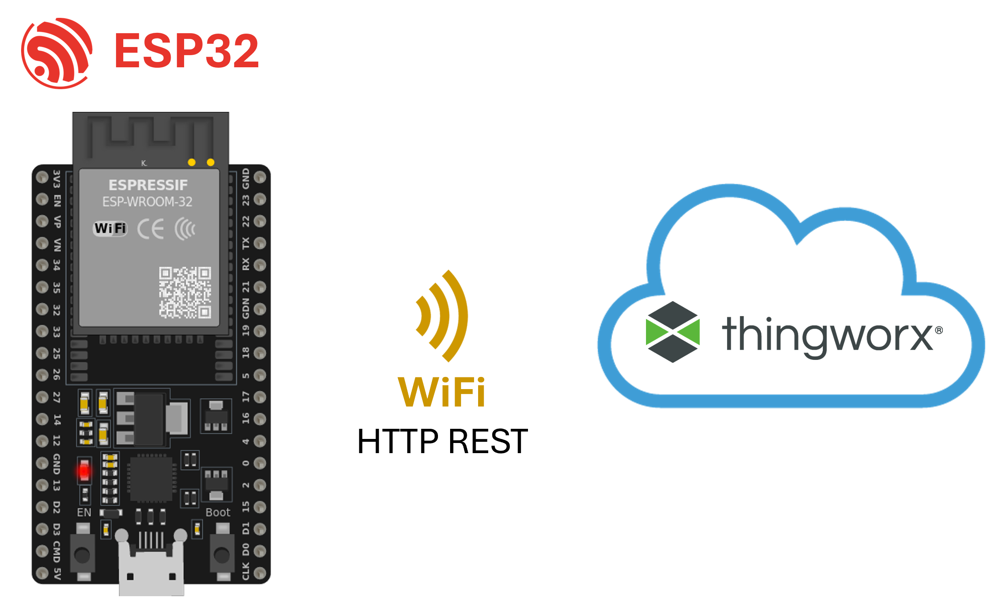

# Thingworx ESP32 Library

Arduino library using REST API to send and receive data to Thingworx platform 8. It allows to send and receive multiple variables with the provided methods.

## Requirements

* ESP32 board (We used the ESP32 WROOM 32 DevKit V1 board)
* [Arduino core for ESP32 v2.0.14 or higher](https://docs.espressif.com/projects/arduino-esp32/en/latest/installing.html)
* [Arduino IDE 1.8.19 or higher](https://www.arduino.cc/en/Main/Software).
* [Thingworx IIoT Platform 9.0 or higher](https://www.ptc.com/en/thingworx)
* [ArduinoJson Library](https://github.com/bblanchon/ArduinoJson) for getThingWorxJSONLib demo

## REST API for Thingworx 9

The REST API implemented in this library follows this format:

GET request
```http
GET /Thingworx/Things/MyThing/Properties/MyProperty HTTP/1.1
Host: thingworx.myserver.com
Accept: application/json
Connection: close
appKey: xxxxxxxx-xxxx-xxxx-xxxx-xxxxxxxxxxxx
```

POST request
```http
POST /Thingworx/Things/MyThing/Services/MyService HTTP/1.1
Host: thingworx.myserver.com
Content-Type: application/json
Content-Length: 27
Connection: close
appKey: xxxxxxxx-xxxx-xxxx-xxxx-xxxxxxxxxxxx

{"MY_PARAM1":123,"MY_PARAM2":abc}
```
